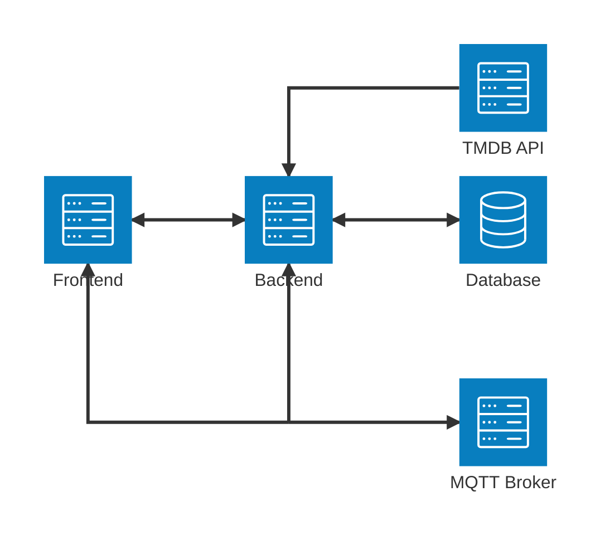

# LynrieScoop Architecture

## System Architecture

LynrieScoop follows a modern web application architecture with distinct frontend and backend components that communicate through RESTful API endpoints and MQTT for real-time messaging.

## Component Overview

### Frontend

- **Technology**: HTML, CSS, TypeScript
- **Build Process**: Compiled from TypeScript to JavaScript
- **Deployment**: Served via Nginx in production
- **Key Features**:
  - Responsive design for both desktop and mobile
  - Role-based UI components (user vs manager views)
  - JWT token management for authentication
  - Real-time seat availability updates

### Backend

- **Framework**: FastAPI (Python)
- **Database**: PostgreSQL with SQLAlchemy ORM
- **Authentication**: JWT-based with role management
- **API Documentation**: Swagger/OpenAPI
- **Key Features**:
  - RESTful API endpoints
  - Database migrations
  - TMDB API integration
  - MQTT messaging for real-time updates

### Database

- **Technology**: PostgreSQL
- **ORM**: SQLAlchemy (async)
- **Key Models**:
  - Users (with role-based permissions)
  - Movies (with TMDB integration)
  - Showings (scheduled movie screenings)
  - Bookings (ticket purchases)
  - Seats and Seat Reservations
  - Cinemas and Rooms

### Messaging

- **Technology**: MQTT (Message Queuing Telemetry Transport)
- **Broker**: Mosquitto
- **Key Topics**:
  - Seat status updates
  - Booking confirmations
  - Screen updates

## Data Flow

1. **Movie Data Flow**:
   - TMDB API → Backend → Database → Frontend

2. **User Authentication Flow**:
   - User credentials → Backend → JWT token → Frontend storage

3. **Booking Flow**:
   - User selection → Backend validation → Database update → MQTT notification → Real-time UI update

4. **Admin Management Flow**:
   - Admin actions → Backend API → Database update → MQTT notification → UI refresh

## Security Architecture

- **Authentication**: JWT-based with token expiration
- **Authorization**: Role-based access control (user vs manager)
- **API Security**: Bearer token validation for protected endpoints
- **Input Validation**: Request validation using Pydantic schemas
- **CORS**: Configured with appropriate origins for development/production
