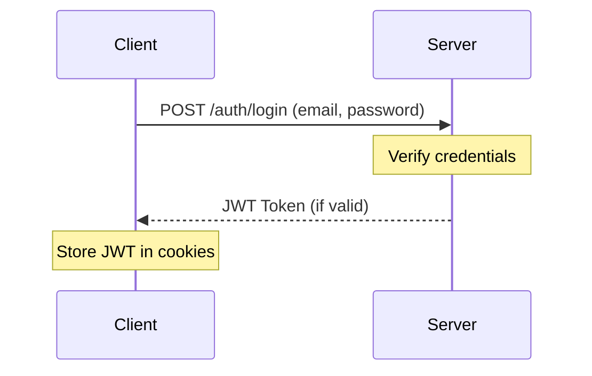

# Authentication System

LynrieScoop implements a robust JWT-based authentication system that provides secure access to user accounts and role-based authorization for different parts of the application.

## Authentication Flow



## JSON Web Tokens (JWT)

### Token Structure

LynrieScoop uses JWT for authentication with the following claims:

```json
{
  "sub": "user_id",      // Subject (user ID)
  "name": "User Name",   // User's display name
  "role": "user",        // Role (user or manager)
  "exp": 1623456789,     // Expiration timestamp
  "iat": 1623456689      // Issued at timestamp
}
```

### Token Lifecycle

- **Creation**: Generated upon successful login/registration
- **Storage**: Stored in client-side cookies with `HttpOnly` flag
- **Expiration**: Defaults to 8 days (configurable)
- **Renewal**: Users must re-authenticate after expiration

## Role-Based Authorization

LynrieScoop implements two primary roles:

### User Role

- Basic authenticated user
- Can browse movies and showings
- Can make bookings and view personal bookings
- Cannot access administration features

### Manager Role

- Extended privileges for cinema management
- Can create/edit/delete movie showings
- Can import and manage movies from TMDB
- Can view all bookings and user information
- Access to administrative dashboards

## Implementation Details

### Backend (FastAPI)

```python
# Token generation (simplified)
def create_access_token(subject: str, name: str, role: str) -> str:
    to_encode = {
        "sub": subject,
        "name": name,
        "role": role,
        "exp": datetime.utcnow() + timedelta(minutes=settings.ACCESS_TOKEN_EXPIRE_MINUTES),
        "iat": datetime.utcnow(),
    }
    return jwt.encode(to_encode, settings.JWT_SECRET, algorithm=settings.JWT_ALGORITHM)
```

```python
# Token verification (simplified)
def get_current_user(token: str = Depends(oauth2_scheme)) -> User:
    try:
        payload = jwt.decode(
            token, settings.JWT_SECRET, algorithms=[settings.JWT_ALGORITHM]
        )
        user_id: str = payload.get("sub")
        if user_id is None:
            raise HTTPException(status_code=401, detail="Invalid token")
        
        # Get user from database using user_id
        return user
    except JWTError:
        raise HTTPException(status_code=401, detail="Invalid authentication credentials")
```

### Frontend (TypeScript)

```typescript
// JWT token decoding and role checking
function decodeJwtPayload(token: string) {
  try {
    const base64Url = token.split('.')[1];
    const base64 = base64Url.replace(/-/g, '+').replace(/_/g, '/');
    return JSON.parse(window.atob(base64));
  } catch {
    return null;
  }
}

// Check if user has manager role
function isManager() {
  const token = getCookie('token');
  if (!token) return false;
  
  const payload = decodeJwtPayload(token);
  return payload && payload.role === 'manager';
}
```

## Security Considerations

- **HTTPS**: All authentication traffic should be encrypted via HTTPS
- **Password Hashing**: Passwords are hashed using bcrypt before storage
- **Token Expiration**: JWTs have a limited lifespan to mitigate risks
- **CORS Protection**: API endpoints are protected with proper CORS headers
- **Role Validation**: Both frontend and backend validate user roles for access control

## Authentication Endpoints

### POST /auth/login

Authenticates a user and returns a JWT token.

### POST /auth/register

Creates a new user account and returns a JWT token.

### GET /auth/me

Returns information about the currently authenticated user.

## User Experience

### Login Process

1. User enters email and password
2. System validates credentials against database
3. On success, JWT token is returned and stored in cookies
4. UI updates to reflect authenticated state

### Registration Process

1. User enters name, email, and password
2. System validates input and checks for existing accounts
3. New user record is created with "user" role
4. JWT token is returned and stored in cookies

### Role-Based UI

The application dynamically adjusts the UI based on the user's role:

- Admin navigation links are only visible to manager users
- Booking functionality requires user authentication
- Admin actions validate role permissions on both client and server
