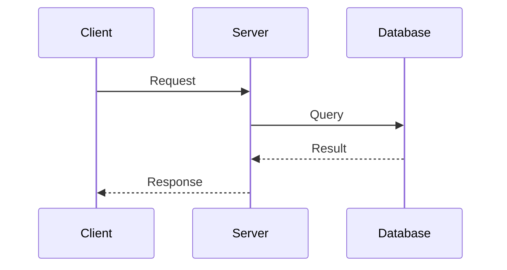

# Documentation Guide

This guide covers how to view, build, and maintain the LynrieScoop documentation.

## Documentation Structure

The LynrieScoop documentation is organized into the following sections:

1. **Project Overview** (README.md) - Introduction and quick-start guide
2. **Architecture** - System design, API reference, authentication, and MQTT integration
3. **Implementation** - Frontend and backend development guides, code quality tools
4. **Operations** - Deployment and maintenance instructions

All documentation files are written in Markdown format and stored in the `docs/` directory.

## Viewing Documentation

### Using MkDocs

LynrieScoop uses [MkDocs](https://www.mkdocs.org/) with the [Material for MkDocs](https://squidfunk.github.io/mkdocs-material/) theme to render the documentation as a searchable, navigable website.

To view the documentation locally:

```bash
cd c:\Data\LynrieScoop
pip install mkdocs mkdocs-material
mkdocs serve -f config/mkdocs/mkdocs.yaml
```

This will start a local documentation server at <http://localhost:8000> where you can browse the rendered documentation.

### Using Docker

You can also use Docker to view the documentation without installing MkDocs locally:

```bash
cd c:\Data\LynrieScoop
docker build -t lynriescoop-docs -f config/mkdocs/Dockerfile .
docker run -p 8000:8000 lynriescoop-docs
```

Then access the documentation at <http://localhost:8000>.

## Building Documentation for Production

To build a static version of the documentation website:

```bash
cd c:\Data\LynrieScoop
mkdocs build -f config/mkdocs/mkdocs.yaml
```

This will create a `site/` directory containing the static HTML, CSS, and JavaScript files for the documentation website.

## Writing Documentation

### Markdown Features

The documentation system supports several Markdown extensions:

- **Code highlighting** with line numbers
- **Admonitions** (notes, warnings, tips)
- **Tabs** for content organization
- **Mermaid** diagrams for architecture visualization

#### Code Blocks

```python
def example_function():
    """This will be syntax highlighted"""
    return "Hello World"
```

#### Admonitions

```markdown
!!! note "Note Title"
    This is a note admonition for important information.

!!! warning "Warning Title"
    This is a warning admonition for crucial information.
```

#### Diagrams



## Maintaining Documentation

### Adding New Pages

To add a new documentation page:

1. Create a new Markdown file in the `docs/` directory
2. Add the file to the navigation structure in `config/mkdocs/mkdocs.yaml`:

```yaml
nav:
  # Existing navigation
  - New Section:
    - New Page: new-page.md
```

### Style Guidelines

When writing documentation, follow these guidelines:

1. Use clear and concise language
2. Include code examples where appropriate
3. Use headings to organize content hierarchically
4. Add diagrams for complex architectural concepts
5. Link related documentation pages together

## Continuous Integration

The documentation is automatically built and validated as part of the CI pipeline. Any Markdown syntax errors or broken links will cause the build to fail.
